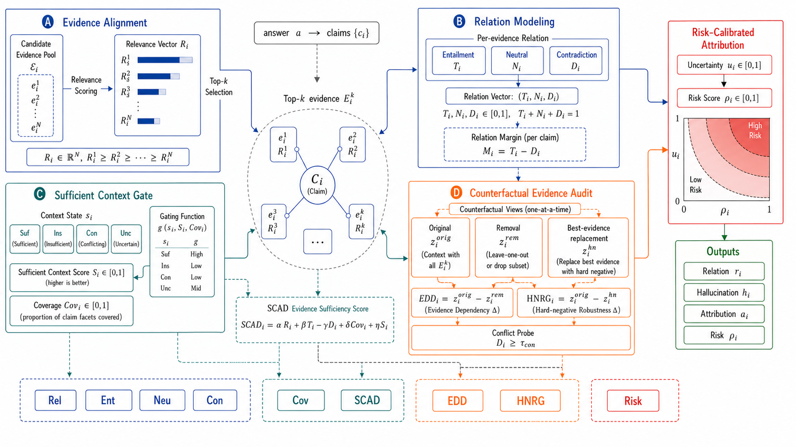

# SCAD-RAG

**SCAD-RAG: Plug-and-Play Context-Sufficiency Auditing for RAG Hallucination Diagnosis**

SCAD-RAG is a local, reproducible research codebase for claim-level hallucination diagnosis in retrieval-augmented generation (RAG). It treats RAG hallucination diagnosis as a **plug-and-play context-sufficiency auditing problem** rather than only a closed binary detection problem. The same diagnostic features can run as a standalone lightweight auditor or be attached to strong external detectors as a post-hoc risk-ranking and attribution layer.

The project is designed for Windows 10/11, RTX 4060 8GB-class hardware, and CPU fallback. It does **not** call OpenAI, Anthropic, Gemini, Cohere, or any commercial LLM API.



## Core Idea

RAG hallucination is not only a generation problem. It is a context-use problem across retrieval, context alignment, and generation. SCAD-RAG models this chain with four groups of signals:

- **Sufficient Context Gate:** estimates whether retrieved context is enough to judge a claim.
- **SCAD Score:** combines relevance, entailment, contradiction, coverage, and sufficient-context signals.
- **Finite-Difference Perturbation Probes:** remove the best context unit and replace it with a hard negative to compute score-sensitivity diagnostics such as EDD and HNRG.
- **Risk-Aware Attribution and Fusion:** output hallucination decisions, attribution labels, uncertainty, NLI reliability, risk scores, and optional external-detector fusion features.

The term counterfactual is used operationally: SCAD-RAG performs controlled context-set perturbations to test score robustness. It does not claim formal causal identification of the generator. The theoretical principle is finite-difference context-sensitivity: a reliable claim-level decision should be supported by sufficient context and should respond when that contextual basis is weakened.

Hard negatives are selected without gold labels in default inference. The selector ranks semantically related candidates by relevance, weak entailment, low coverage, and contradiction tendency, then falls back to a low-relevance distractor if no suitable candidate exists. Contradiction attribution is guarded by an NLI reliability gate so high-neutral or low-coverage cases abstain instead of being forced into fine-grained labels.

## Features

- Local inference only; no API-key service is used.
- Offline `quick_test` runs with toy data and dummy models.
- Real-model mode supports local Hugging Face embedding and NLI models.
- Strict no-gold inference mode prevents label leakage at prediction time.
- RAGTruth downloader and adapter with field and conversion reports.
- FEVER and SciFact adapters for relation calibration and domain transfer.
- Lightweight baselines: majority, lexical overlap, similarity-only, NLI-only, ESS-rule, SC-Gate-only, REFIND-inspired, and optional external detector adapters.
- External detector fusion scripts for LettuceDetect, HHEM, and Osiris-style local/open hallucination detectors.
- Threshold tuning, ablation, manual-check sampling, risk diagnostics, and LaTeX table export.

## Paper-Facing Results

RAGTruth is highly imbalanced, so Accuracy is reported as an auxiliary metric. Hallucination-F1, Binary Macro-F1, AUROC, and risk-error correlation are the main paper-facing metrics.

| Method | Hall-F1 | Binary Macro-F1 | AUROC | Accuracy | Risk Corr. |
|---|---:|---:|---:|---:|---:|
| Majority | 0.1612 | 0.0806 | 0.5489 | 0.0876 | -0.0908 |
| Lexical-overlap | 0.1712 | 0.1626 | 0.5489 | 0.1627 | 0.0182 |
| Similarity-only | 0.1353 | 0.4239 | 0.5489 | **0.5684** | -0.4003 |
| NLI-only | 0.1852 | 0.2741 | 0.5489 | 0.2824 | 0.0831 |
| ESS-rule | 0.1839 | 0.2581 | 0.5489 | 0.2629 | 0.1073 |
| SCAD-RAG-Rule | 0.1856 | 0.2510 | 0.5415 | 0.2462 | 0.1142 |
| SCAD-RAG-Calibrated | **0.2028** | **0.4453** | **0.6061** | 0.5512 | **0.4503** |

### Plug-in Fusion with External Detectors

SCAD-RAG can also be used as a post-hoc audit layer over strong open-source detectors. In RAGTruth-500 fusion diagnostics, SCAD score fusion improves selective-risk ranking and several detection metrics for LettuceDetect, HHEM, and Osiris-3B style detectors. Across the three detectors, SCAD-score fusion reduces selective-risk AUC by an average relative reduction of **39.51%** and improves accuracy by an average relative gain of **9.80%**.

| System | Hall-F1 | AUROC | Accuracy | Brier | SR-AUC |
|---|---:|---:|---:|---:|---:|
| LettuceDetect | 0.6082 | 0.8527 | 0.9524 | 0.0521 | 0.0244 |
| LD + SCAD-score | **0.6182** | **0.8824** | **0.9552** | **0.0508** | **0.0159** |
| LD + SCAD-risk | 0.6082 | 0.8527 | 0.9524 | 0.0521 | 0.0162 |
| HHEM | **0.2392** | 0.7463 | 0.8372 | 0.2974 | 0.0418 |
| HHEM + SCAD-score | 0.1918 | **0.7529** | **0.8742** | **0.2373** | **0.0336** |
| HHEM + SCAD-risk | **0.2392** | 0.7463 | 0.8372 | 0.2974 | 0.0418 |
| Osiris-3B | **0.1960** | 0.6325 | 0.7143 | **0.2386** | 0.1016 |
| Osiris + SCAD-score | 0.1720 | **0.7187** | **0.8905** | 0.2534 | **0.0365** |
| Osiris + SCAD-risk | **0.1960** | 0.6325 | 0.7143 | **0.2386** | 0.0805 |

Additional paper-facing tables and SVG figures are available in [`paper_assets/`](paper_assets/):

- [`paper_assets/tables/ragtruth_main_results.md`](paper_assets/tables/ragtruth_main_results.md)
- [`paper_assets/tables/external_detector_fusion.md`](paper_assets/tables/external_detector_fusion.md)
- [`paper_assets/tables/fever_relation_results.md`](paper_assets/tables/fever_relation_results.md)
- [`paper_assets/tables/risk_diagnostics.md`](paper_assets/tables/risk_diagnostics.md)
- [`paper_assets/figures/evidence_perturbation_probe.svg`](paper_assets/figures/evidence_perturbation_probe.svg)

## Installation

```powershell
cd "C:\path\to\scad_rag"
python -m venv .venv
.\.venv\Scripts\Activate.ps1
pip install -e ".[dev]"
```

For real local Hugging Face models:

```powershell
pip install -e ".[default,dev]"
```

If GPU memory is limited, use `configs/cpu.yaml` or reduce `batch_size` and `nli_batch_size`.

## Quick Test

The quick test requires no network, no GPU, no real dataset, and no model download:

```powershell
python -m scad_rag.cli.prepare_data --config configs/quick_test.yaml --dataset toy
python -m scad_rag.cli.run_pipeline --config configs/quick_test.yaml --method scad_rag
python -m scad_rag.cli.evaluate --config configs/quick_test.yaml
python -m scad_rag.cli.compare_baselines --config configs/quick_test.yaml
```

Or run:

```powershell
.\scripts\run_quick_test.ps1
```

## Real RAGTruth Experiment

Download public RAGTruth files:

```powershell
python -m scad_rag.cli.download_ragtruth --out_dir data/raw/ragtruth --verify true
```

Prepare a 500-sample run:

```powershell
python -m scad_rag.cli.prepare_data --config configs/default.yaml --dataset ragtruth --max_samples 500
python -m scad_rag.cli.tune_thresholds --config configs/default.yaml --dataset ragtruth --split validation --max_samples 500
python -m scad_rag.cli.run_pipeline --config configs/default.yaml --method scad_rag --max_samples 500
python -m scad_rag.cli.compare_baselines --config configs/default.yaml --max_samples 500
```

Or run the scripted pipeline:

```powershell
.\scripts\run_ragtruth_500.ps1
```

## Real-Model Smoke Test

```powershell
.\scripts\run_real_model_smoke_test.ps1
```

This checks whether local embedding and NLI models load correctly, whether CUDA/CPU device selection works, and whether `predictions.csv` and `metrics.json` are generated.

## No API Guard

Run the guard before release or experiments:

```powershell
python -m scad_rag.utils.no_api_guard
```

The guard scans `src/`, `scripts/`, and `tests/` for forbidden commercial API imports and endpoints.

## Main Outputs

Each pipeline run creates `experiments/runs/{timestamp}_{method}/` with:

- `predictions.jsonl`
- `predictions.csv`
- `sentence_level_results.csv`
- `claim_evidence_scores.csv`
- `sufficient_context_results.csv`
- `counterfactual_audit.csv`
- `risk_calibration.csv`
- `metrics.json`
- `case_studies.md`
- `error_analysis.md`
- `latex_table_metrics.txt`

Generated runs, real datasets, and model files are ignored by Git.

## Reproducibility Notes

- `configs/quick_test.yaml` uses dummy models and bundled toy data.
- `configs/default.yaml` uses local Hugging Face models and `device: auto`.
- `strict_no_gold_inference: true` is enabled for prediction by default.
- All baselines share the same processed dataset, claim split, evidence set, and top-k configuration.

## Repository Scope

This repository contains the core research code, toy data, tests, configuration files, experiment scripts, and lightweight paper-facing assets. It does not include real RAGTruth/FEVER/SciFact files, generated experiment run folders, model checkpoints, or compiled manuscript PDFs.

## Citation

If this repository is useful, cite the accompanying manuscript:

```bibtex
@misc{scadrag2026,
  title = {SCAD-RAG: Plug-and-Play Context-Sufficiency Auditing for RAG Hallucination Diagnosis},
  author = {Wang, Yi and Shang, Wenqian and Yi, Tong and Zhu, Haibin},
  year = {2026},
  note = {Code: https://github.com/wangyi11111111/SCAD-RAG}
}
```

## License

MIT License. See `LICENSE`.
